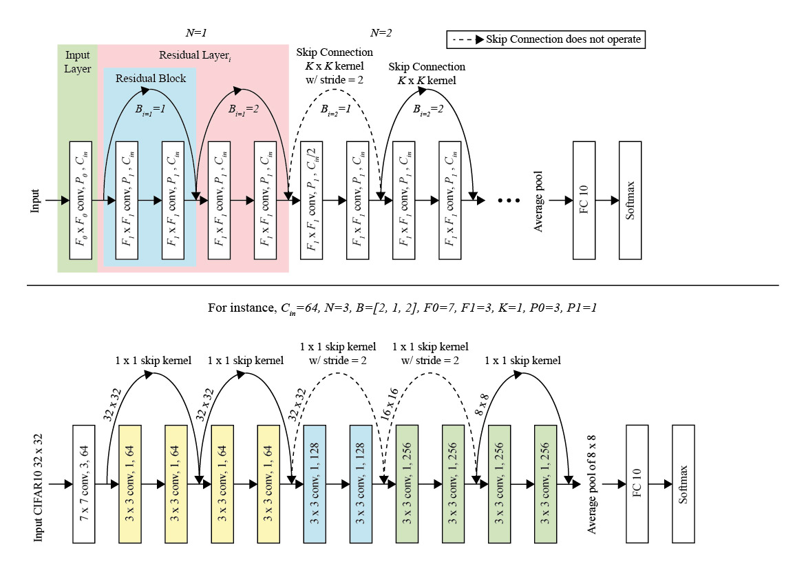

# Scalable ResNet on CIFAR10 using PyTorch

## Requirements
- Python 3.6+
- PyTorch 1.0+

## How to use
```
# Start training with: 
python project1_model.py

# You can manually assign parameters with: 
python project1_model.py --lr 0.01

# To list all configurable parameters use: 
python project1_model.py -h

```

## Adjustable Parameters
| Description | DType       | Arguments  | Default | 
| ----------- | ----------- | ---------- | ------- | 
| Optimizer                              | string | o          | sgd | 
| Learning rate                          | float  | lr         | [based on optimizer](#optimizer) | 
| Momentum                          	 | float  | m          | [based on optimizer](#optimizer) | 
| Weight decay                           | float  | w          | [based on optimizer](#optimizer) | 
| Dataset directory                      | string | path       | ./CIFAR10/  | 
| Number of epochs                            | int    | e          | 5   | 
| Number of data loader workers               | int    | w          | 2   | 
| Number of residual layers                   | int    | n          | 4   | 
| Number of residual blocks in each of the residual layers | int    | b           | 2 1 1 1 | 
| Number of channels in the first residual layer     | int    | c           | 64      | 
| Input layer convolutional kernel size   		 	 | int    | f0        	 | 3       | 
| Residual layer convolutional kernel size   		 | int    | f1        	 | 3       | 
| Skip connection kernel sizes 			 	| int    | k     	  	 | 1       | 
| Input layer convolutional padding size 	| int    | p0     	  	 | 1       | 
| Residual layer convolutional padding size | int    | p1     	  	 | 1       | 

## Parameter Setting explanation



## References
Liu K., Train CIFAR10 with PyTorch [(2017)](https://github.com/kuangliu/pytorch-cifar). 