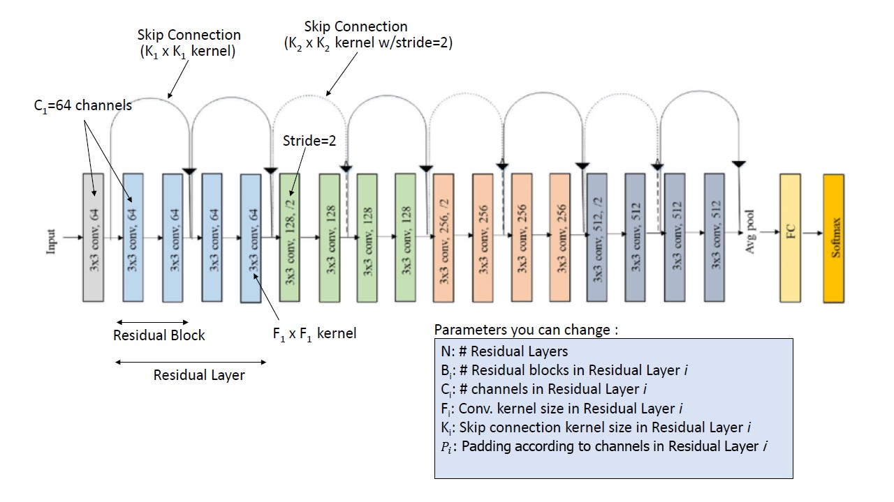

# Residual Networks
ResNets PyTorch CIFAR10 Training

## Prerequisites
- Python 3.6+
- PyTorch 1.0+

## Training
```
# Start training with: 
python main.py

# You can manually assign parameters with: 
python main.py --lr 0.01

# To list all configurable parameters use: 
python main.py -h

```

## Parameters
| Description | DType       | Arguments  | Default | 
| ----------- | ----------- | ---------- | ------- | 
| Optimizer                              | string | o          | sgd | 
| Learning rate                          | float  | lr         | [based on optimizer](#optimizer) | 
| Momentum                          	 | float  | m          | [based on optimizer](#optimizer) | 
| Weight decay                           | float  | w          | [based on optimizer](#optimizer) | 
| Dataset directory                      | string | path       | ./CIFAR10/  | 
| # of epochs                            | int    | e          | 5   | 
| # of data loader workers               | int    | w          | 8   | 
| # of residual layers                   | int    | n          | 4   | 
| # of residual blocks in each of the residual layers | int    | b           | 2 2 2 2 | 
| # of channels in the first residual layer       | int    | c           | 64      | 
| Convolutional kernel sizes    		 | int    | f        	 | 3       | 
| Skip connection kernel sizes 			 | int    | k     	  	 | 1       | 
| # of padding at input conv layer and conv inside residual layer| int    | p     	  	 | 1  1    | 



## Accuracy
| Parameter Setting | Acc.        |
| ----------------- | ----------- |
| --e 100 --w 8 --n 3 --b 1 3 1 --f 5 --k 1 --p 0 2         |  00.00%     |

## <a id="optimizer">Optimizer setting</a>
| Name 		  | Learning rate | Weight decay | Momentum  | 
| ----------- | ------------- | ---------- | ---------- |
| [SGD](https://pytorch.org/docs/stable/generated/torch.optim.SGD.html)         		 | 0.1 		  | 0.0005     | 0.9		|
| [SGD /w Nesterov](https://pytorch.org/docs/stable/generated/torch.optim.SGD.html)    | 0.1 		  | 0.0005     | 0.9        |
| [Adam](https://pytorch.org/docs/stable/generated/torch.optim.Adam.html)			     | 0.001 	  | 0.0005     | None       |
| [Adagrad](https://pytorch.org/docs/stable/generated/torch.optim.Adagrad.html)			 | 0.01 	  | 0.0005     | None       |
| [Adadelta](https://pytorch.org/docs/stable/generated/torch.optim.Adadelta.html)				 | 1.0  	  | 0.0005     | None       |

Anything other parameters that did not display in the above table uses default [PyTorch](https://pytorch.org/)'s setting.


Test referencing [[1]](#1)
## References
<a id="1">[1]</a> 
Sebastian Ruder [(2017)](https://arxiv.org/pdf/1609.04747.pdf). 
An overview of gradient descent optimization algorithms. 
Chapter 4 gradient descent optimization algorithms, (p.) 4-9.