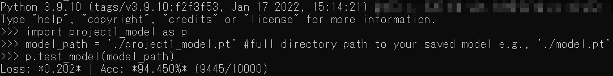
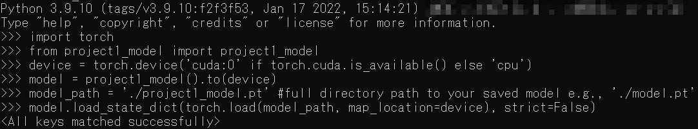
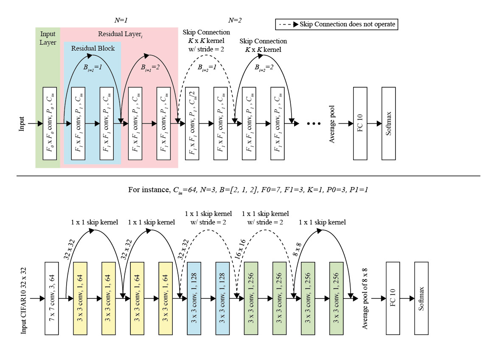

# Scalable ResNet on CIFAR-10 using PyTorch

## Requirements
- Python 3.6+
- PyTorch 1.0+
- TorchVision 0.1+

## How to train
```
# Easily start a new training, run: 
python project1_model.py

# You can manually assign parameters with: 
python project1_model.py --lr 0.01

# To list all configurable parameters use: 
python project1_model.py -h

```
## How to re-test your saved model
```
# Start your python interactive shell and type these commands: 
import project1_model as p
model_path = './project1_model.pt' #full directory path to your saved model e.g., './model.pt'
p.test_model(model_path)
```

## You can also load and view the saved model weights and structures
```
# Start your python interactive shell and type these commands: 
import torch
from project1_model import project1_model
device = torch.device('cuda:0' if torch.cuda.is_available() else 'cpu')
model = project1_model().to(device)
model_path = './project1_model.pt' #full directory path to your saved model e.g., './model.pt'
model.load_state_dict(torch.load(model_path, map_location=device), strict=False)
model.eval()
```

## Adjustable parameters
| Description | DType       | Arguments  | Default | 
| ----------- | ----------- | ---------- | ------- | 
| Optimizer                              | string | o          | sgd | 
| Learning rate                          | float  | lr         | [based on optimizer](#optimizer) | 
| Momentum                          	 | float  | m          | [based on optimizer](#optimizer) | 
| Weight decay                           | float  | wd         | [based on optimizer](#optimizer) | 
| Dataset full path                      | string | path       | ./CIFAR10/  | 
| Saved model full path                  | string | mp       | ./project1_model.pt  | 
| Number of epochs                            | int    | e          | 5   | 
| Number of data loader workers               | int    | wk         | 2   | 
| Number of residual layers                   | int    | n          | 4   | 
| Number of residual blocks in each of the residual layers | int    | b           | 2 1 1 1 | 
| Number of channels in the first residual layer     | int    | c           | 64      | 
| Input layer convolutional kernel size   		 	 | int    | f0        	 | 3       | 
| Residual layer convolutional kernel size   		 | int    | f1        	 | 3       | 
| Skip connection kernel sizes 			 	| int    | k     	  	 | 1       | 
| Input layer convolutional padding size 	| int    | p0     	  	 | 1       | 
| Residual layer convolutional padding size | int    | p1     	  	 | 1       | 

## Parameter setting explanation



## <a id="optimizer">Default optimizer's setting</a>
| Name 		  | Learning rate | Weight decay | Momentum  | 
| ----------- | ------------- | ---------- | ---------- |
| [SGD](https://pytorch.org/docs/stable/generated/torch.optim.SGD.html)           | 0.1 	  | 0.0005|0.9|
| [SGD /w Nesterov](https://pytorch.org/docs/stable/generated/torch.optim.SGD.html) | 0.1 	  | 0.0005|0.9|
| [Adam](https://pytorch.org/docs/stable/generated/torch.optim.Adam.html)			| 0.001   | 0.0005|None|
| [Adadelta](https://pytorch.org/docs/stable/generated/torch.optim.Adadelta.html)	| 1.0  	  | 0.0005|None|
| [Adagrad](https://pytorch.org/docs/stable/generated/torch.optim.Adagrad.html)		| 0.01 	  | 0.0005|None|


## References
Liu K., Train CIFAR10 with PyTorch (2017). [https://github.com/kuangliu/pytorch-cifar](https://github.com/kuangliu/pytorch-cifar). 